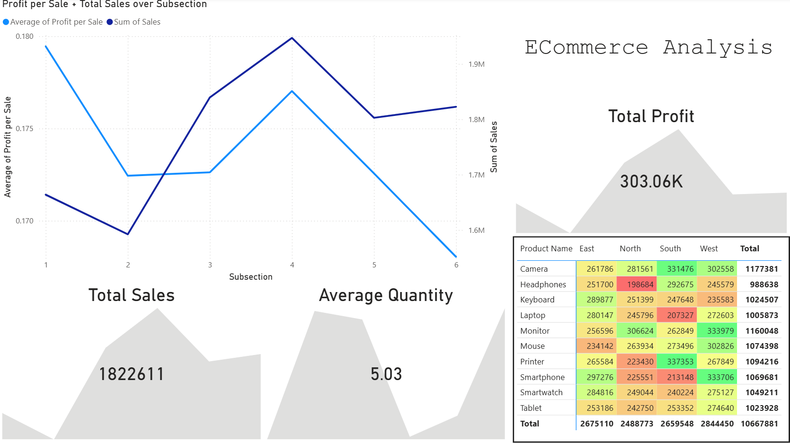
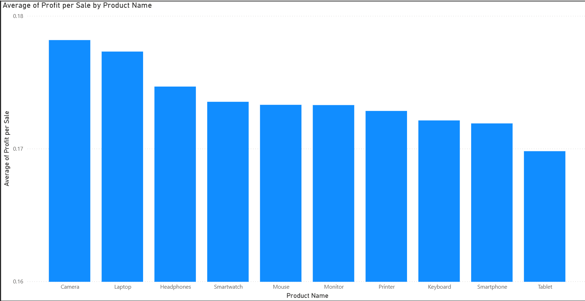

# ECommerce-Data-Analysis
A simple analysis of an e-commerce data set found on Kaggle. Contains data cleaning via Pandas, an overview-heatmap via Seaborn and Matplotlib, and further dashboards on PowerBI.

## Introduction
The data set contains 3500 rows of sales data, with Product Name, Region, date, # of sales, and profit per sale. The goal of my analysis was to clean and investigate the data, and generate some insights on how different products were performing over time and over regions. I also aimed to come up with a couple of recommendations.

## Python step
Note that the Python file is attached in the "Raw Data" folder.

I first cleaned the data using dropna(). Subsequently I created two new columns: "Subsection" and "Profit per Sale". Then, using Seaborn and matplotlib, I created one heat-map matrix, showing the profit per sale of each product, by region. I added a color-scale for clarity. This aims to provide a very brief overview of the data before moving onto the graphs.

We can see that the North region has some standout good and bad products; Smart Watches, Laptops, and Cameras do good, while Printers, Mice, and Smartphones do not. We can also see Cameras have the most profit per sale overall, while Tablets have the least. Already, then, we start to get an idea on which products perform well. For example, we can consider focusing on Smartphones in the East rather than the South. However, since this is only one metric, more insight needs to be generated before we can start making recommendations.

## PowerBI Charts

### Main Dashboard

This dashboard serves as an overview of the data, with three KPIs and two charts for analysis. The first is an indication on how total sales and average profit per sale fluctuates through subsection, which is essentially a half of a year (Subsection 1 is Jan 1 to Jun 30 of 2022, and Subsection 6 is Jul 1 to Dec 31 of 2024). We can see that there was overall movement upwards through subsections 2-4, and downturn from subsections 4-6, and from 1-2. This should be kept in mind when looking at later charts.

The second chart is similar to the earlier heatmap, but instead of profit per sale, it's total sales. So we can see in sheer quantity, West has the most sales, with Monitors and Smartphones being really strong products there, while North has also good Monitor sales but less of everything else, particularly Headphones. This is less of a picture of what products are doing well, per se, as population size plays a big role in the results of this chart, but moreso of sheer quantity.

### Product Performance Charts

