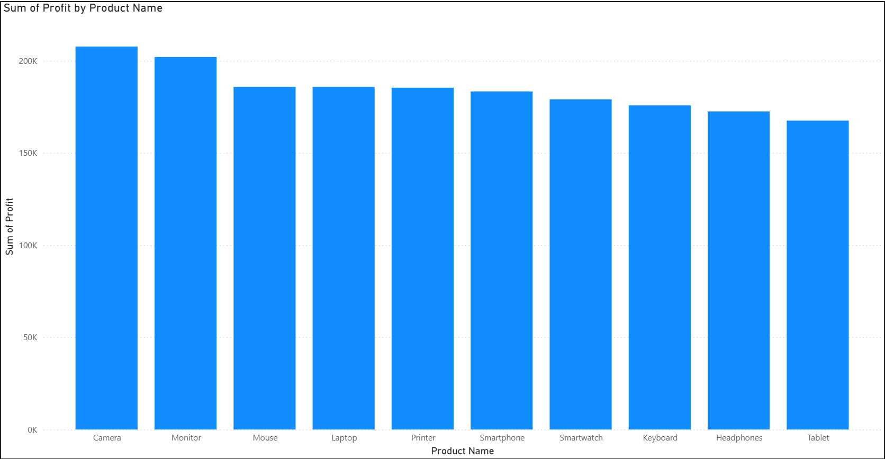
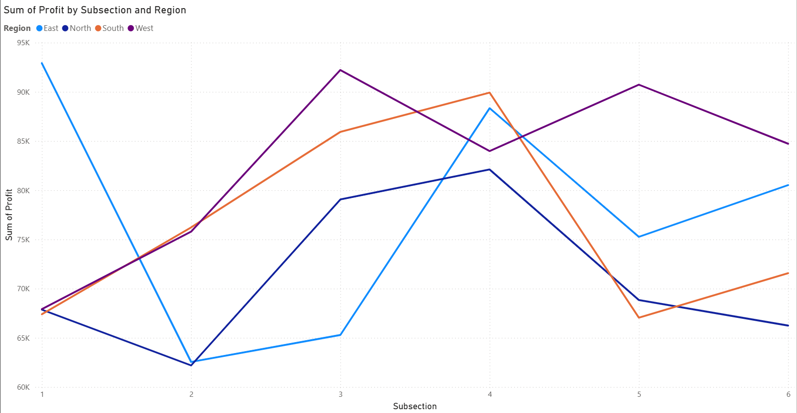
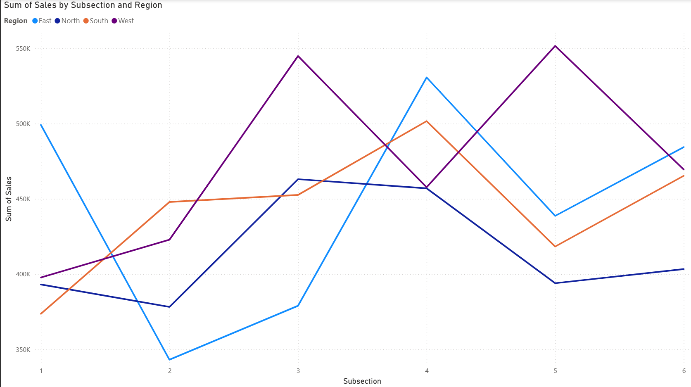
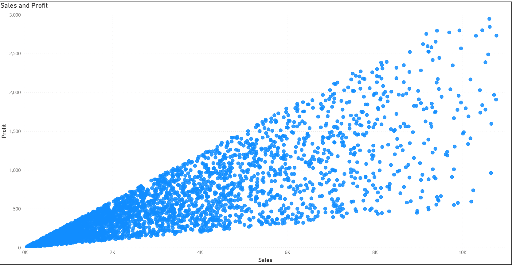

# ECommerce-Data-Analysis
A simple analysis of an e-commerce data set found on Kaggle. Contains data cleaning via Pandas, an overview-heatmap via Seaborn and Matplotlib, and further dashboards on PowerBI.

## Introduction
The data set contains 3500 rows of sales data, with Product Name, Region, date, # of sales, and profit per sale. The goal of my analysis was to clean and investigate the data, and generate some insights on how different products were performing over time and over regions. I also aimed to come up with a couple of recommendations.

## Python step
Note that the Python file is attached in the "Raw Data" folder.

I first cleaned the data using dropna(). Subsequently I created two new columns: "Subsection" and "Profit per Sale". Then, using Seaborn and matplotlib, I created one heat-map matrix, showing the profit per sale of each product, by region. I added a color-scale for clarity. This aims to provide a very brief overview of the data before moving onto the graphs.

We can see that the North region has some standout good and bad products; Smart Watches, Laptops, and Cameras do good, while Printers, Mice, and Smartphones do not. We can also see Cameras have the most profit per sale overall, while Tablets have the least. Already, then, we start to get an idea on which products perform well. For example, we can consider focusing on Smartphones in the East rather than the South. However, since this is only one metric, more insight needs to be generated before we can start making recommendations.

## PowerBI Charts

### Main Dashboard

This dashboard serves as an overview of the data, with three KPIs and two charts for analysis. The first is an indication on how total sales and average profit per sale fluctuates through subsection, which is essentially a half of a year (Subsection 1 is Jan 1 to Jun 30 of 2022, and Subsection 6 is Jul 1 to Dec 31 of 2024). We can see that there was overall movement upwards through subsections 2-4, and downturn from subsections 4-6, and from 1-2. This should be kept in mind when looking at later charts.

The second chart is similar to the earlier heatmap, but instead of profit per sale, it's total sales. So we can see in sheer quantity, West has the most sales, with Monitors and Smartphones being really strong products there, while North has also good Monitor sales but less of everything else, particularly Headphones. This is less of a picture of what products are doing well, per se, as population size plays a big role in the results of this chart, but moreso of sheer quantity.

### Product Performance Charts

These two charts showcase the performance of each product by both total profit and profit per sale - in other words, quantity and quality. The standout products are Cameras, which top both charts, and Tablets, which round out the bottom of both. Laptops and Mice perform well in both, while Keyboards are another product that did not perform as well.

From these two charts, we can see that Cameras are one of the more important products key to the company's success, and thus deserves more investigation.

### Region/Subsection Charts

These two charts demonstrate the regional success over time with two metrics: total profit and total sales. Both of these charts show similar shapes of lines for each region, indicating a relatively constant profit per sale for each region over time. They also generally follow the pattern from the main dashboard, with a general increase up to subsection 4, then a general decrease. The West region is an exception to this, with peaks in subsections 3 and 5 suggesting they were not affected by the same boom as others did in subsection 4. This shows that West is perhaps a region to focus on as well.

### Sales vs Profit Chart

This chart doesn't provide much actual business insight but is nonetheless extremely intriguing to analyze. Most transaction are clustered near the bottom left, meaning there are more small-scale transactions than large-scale ones, which makes sense. But the interesting element here is the two invisible lines bounding the data, suggesting that the profit per sale is limited to a minimum or maximum. Roughly, the top "line" corresponds to a profit-per-sale value of 0.333, while the bottom "line" represents a profit-per-sale value of 0.050. This puts reasonable bounds around the average profit-per-sale value of 0.175, from the first dashboard. It's possible that these bounds are artificial, especially since the bounds are close to "nice" fractions (1/3 and 1/20 respectively). However we know these cannot be fixed values per product, as the Python heatmap shows. This point is very interesting to consider.

## Key Insights

1. **Cameras are a well-performing product.**
They have the highest profit-per-sale, total sales, AND total profit, showing that they perform well in terms of both quantity *and* quality.

2. **Tablets perform poorly.**
They have the lowest profit-per-sale and total profit, and the third lowest total sales.

3. **The West's deviation is worth looking at.**
They were the only region to deviate from the pattern of peak profit/sales @ subsection 4. Maybe the products that sold well for West should be looked at in the first half of each year (Subsections 3/5).

4. **Profit-per-sale ranges strictly from 0.050 to 0.333.**
There are a substantial number of transactions occuring along those lines, that is to say, exactly at 0.050 or 0.333. However, these numbers were not by product.

5. **Subsection 4 heights need to be re-achieved.**
Subsection 4 showed the clearest peak in terms of both total Sales and Profit per Sale, again, quality *and* quantity.

## Business Recommendations

1. **Focus more on cameras, particularly in the North and South regions.**
The South had the most total sales and the North, the most profit per sale.

2. **Cut back on tablets, especially in the South.**
With tablets being the worst-performing product, resources would be better allocated elsewhere.

3. **Emphasize the West.**
With it being one of the best-performing regions in both average profit-per-sale and total sales, the West clearly is the region to be prioritized. Monitors are the best-performing product in this key region, while keyboards and tablets perform less well; these products can thus be adjusted. Additionally, West's uniqueness in its performance over time raises its priority even more.
